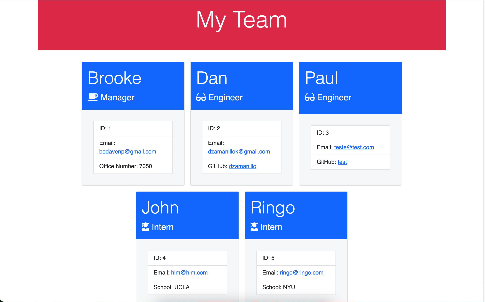

# Team Keeper

## Description

Team Keeper is a command line application that allow a user to input information about employees to create a HTML page. See a sample in /dist.

## Table of Contents

- [Installation](#installation)
- [Questions](#questions)
- [Credits](#credits)
- [License](#license)

## Installation

[Video](https://drive.google.com/file/d/1NAYgQpJ0YRoCh208MSzjdozmAr7JWbkK/view)

> node index.js

## Questions

Please feel free to reach out to me on my [GitHub](https://github.com/dzamanillo).

You can also email me at dzamanillok@gmail.com

## Credits

Daniel Zamanillo

Also powered by:

- Jest
- Inquirer

## License

None at the moment
